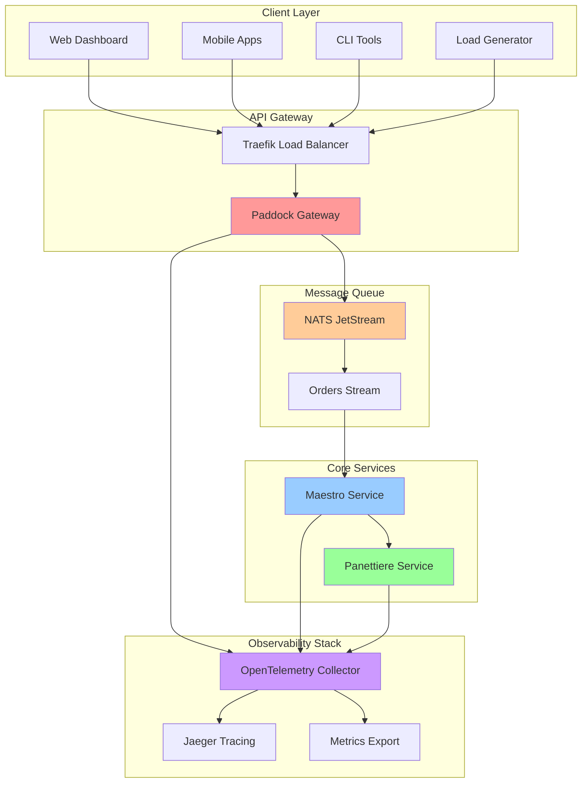

# Box Box (for Pizza!) 🏎️🍕

A distributed microservices system that simulates a pizza ordering and preparation workflow for Scuderia Ferrari's Formula 1 team. Built with Go, the system demonstrates modern distributed architecture patterns, observability, and realistic human behavior simulation in a fun Formula 1 themed context.

## 🏁 Project Motivation

"Box Box" is the Formula 1 radio call meaning "come into the pit for a pit stop." This project extends that concept to pizza ordering - when the Ferrari team gets hungry during those long race weekends, they need a reliable, fast, and observable pizza ordering system!

### Why This Project?

- **Learning Platform**: Demonstrates distributed systems patterns including microservices, message queues, observability, and API gateways
- **Realistic Simulation**: Models human behavior patterns (sleep schedules, lunch breaks, work variance) in service interactions
- **Modern Tech Stack**: Showcases contemporary Go development with gRPC, REST APIs, OpenTelemetry, and containerization
- **Formula 1 Theme**: Makes learning distributed systems fun with Ferrari-themed services and terminology

## 🏗️ System Architecture



## 🏎️ Services Overview

### 🏁 **Paddock Gateway**
The main entry point - a REST API gateway that handles pizza orders and provides real-time monitoring via Server-Sent Events (SSE).

**Key Features:**
- RESTful API for order creation
- Real-time order tracking via SSE
- NATS JetStream integration
- Swagger API documentation
- Health monitoring

### 👨‍🍳 **Maestro Service** 
The orchestrator - coordinates the entire pizza preparation workflow, managing orders from start to finish while maintaining realistic human behavior.

**Key Features:**
- Batch order processing
- Lunch break scheduling
- Smoking sessions after each order (with potential oversmoking!)
- gRPC service with health checks
- OpenTelemetry metrics and tracing

### 🍞 **Panettiere Service**
The baker - creates pizza dough on demand with realistic timing and sleep patterns.

**Key Features:**
- Dough preparation with configurable timing variance
- Sleep cycles that affect availability
- Oversleeping probability simulation
- gRPC API for dough requests
- Resource exhaustion handling when sleeping

### 📊 **Tifosi Load Generator**
Ferrari fans (tifosi) generating realistic load patterns using K6 performance testing.

**Key Features:**
- Realistic load scenarios (Ferrari winning vs losing!)
- Automated testing workflows
- Performance benchmarking

## 🚀 Quick Start

### Prerequisites

- [Docker](https://docs.docker.com/get-docker/) and [Docker Compose](https://docs.docker.com/compose/install/)
- [Task](https://taskfile.dev/installation/) (modern Make alternative)
- [Go 1.25+](https://golang.org/dl/) (for local development)

### 🏃‍♂️ Running the Complete System

1. **Start auxiliary services** (NATS message queue):
   ```bash
   task aux:up
   ```

2. **Start telemetry stack** (OpenTelemetry, Jaeger):
   ```bash
   task telemetry:up
   ```

3. **Start core services** (Paddock Gateway, Maestro, Panettiere):
   ```bash
   task services:up
   ```

4. **Generate some load** (optional):
   ```bash
   task load-generator:up
   ```

### 🎯 Access Points

Once running, you can access:

- **Paddock Gateway API**: http://paddock-gateway.docker.localhost
- **Swagger Documentation**: http://paddock-gateway.docker.localhost/swagger/
- **Traefik Dashboard**: http://dashboard.docker.localhost/dashboard/
- **Jaeger Tracing**: http://localhost:16686
- **NATS Monitoring**: http://localhost:8222

### 🧪 Testing the System

Create a pizza order:
```bash
curl -X POST http://paddock-gateway.docker.localhost/v1/order \
  -H "Content-Type: application/json" \
  -d '{
    "size": "large",
    "toppings": ["pepperoni", "mushrooms"],
    "destination": "Ferrari Garage #16",
    "username": "charles_leclerc"
  }'
```

Monitor orders in real-time:
```bash
curl -N http://paddock-gateway.docker.localhost/v1/order/sse
```

## 📁 Project Structure

```
box-box/
├── 🏁 paddock-gateway/          # HTTP API Gateway
│   ├── main.go                  # Service entry point
│   ├── handler.go               # REST API handlers
│   ├── nats_orderpubsubber.go   # NATS integration
│   ├── dto.go                   # Data transfer objects
│   ├── docs/                    # Generated Swagger docs
│   └── Taskfile.yaml           # Service tasks
│
├── 👨‍🍳 maestro/               # Order orchestration service
│   ├── main.go                  # Service entry point
│   ├── handler.go               # Business logic
│   ├── settings.go              # Configuration
│   ├── v1/                      # Generated gRPC code
│   └── Taskfile.yaml           # Service tasks
│
├── 🍞 panettiere/              # Dough preparation service
│   ├── main.go                  # Service entry point
│   ├── settings.go              # Configuration
│   ├── v1/                      # Generated gRPC code
│   └── Taskfile.yaml           # Service tasks
│
├── 📊 tifosi-load/             # Load testing with K6
│   ├── script.js                # Load test scenarios
│   ├── Dockerfile               # Container setup
│   └── Taskfile.yaml           # Testing tasks
│
├── 🔧 pacchetto/               # Shared utilities library
│   ├── grpc.go                  # gRPC helpers
│   ├── settings.go              # Configuration utilities
│   └── telemetry/               # OpenTelemetry setup
│
├── 📡 proto/                   # Protocol buffer definitions
│   ├── maestro/v1/              # Maestro service API
│   └── panettiere/v1/           # Panettiere service API
│
├── 🐳 docker-compose.yml       # Container orchestration
├── 📋 Taskfile.yaml            # Main task definitions
└── 🔧 otel-collector-config.yaml # Observability config
```

## 🛠️ Development Commands

### Main Project Tasks

```bash
# Infrastructure Management
task aux:up              # Start NATS message queue
task aux:down            # Stop auxiliary services
task telemetry:up        # Start observability stack
task telemetry:down      # Stop telemetry services
task services:up         # Start all microservices
task services:down       # Stop all microservices

# Individual Service Control
task nats:up             # Start only NATS
task jaeger:up           # Start only Jaeger
task otel-collector:up   # Start only OpenTelemetry Collector

# Load Testing
task load-generator:up   # Start K6 load testing
```

### Service-Specific Tasks

Each service has its own Taskfile with development commands:

```bash
# Paddock Gateway
task paddock-gateway:build           # Build the service
task paddock-gateway:run             # Run locally
task paddock-gateway:test:light      # Run unit tests
task paddock-gateway:generate-swagger # Update API docs

# Maestro Service
task maestro:build                   # Build the service
task maestro:run                     # Run locally
task maestro:format                  # Format code

# Panettiere Service  
task panettiere:build                # Build the service
task panettiere:run                  # Run locally
task panettiere:test:light           # Run unit tests
```

## 🔍 Observability Features

### Distributed Tracing
- **Jaeger Integration**: Full request tracing across service boundaries
- **Correlation IDs**: Track orders through the entire system
- **Performance Monitoring**: Identify bottlenecks and latency issues

### Metrics Collection
- **Service Metrics**: Request rates, error rates, duration percentiles
- **Business Metrics**: Order processing rates, human behavior patterns
- **Infrastructure Metrics**: Resource utilization, health status

### Structured Logging
- **Contextual Logging**: Every log entry includes request context
- **Log Correlation**: Logs tied to distributed traces
- **Multi-level Logging**: Debug, info, warn, error levels

## 🎮 Load Testing Scenarios

The tifosi load generator simulates different Ferrari performance scenarios:

### Ferrari is Losing 😢
- Gradual ramp-up: 0 → 10 users over 10s
- Stress testing: Maintains load for 10s
- Cool down: Back to 0 users

### Ferrari is Winning! 🏆
- Base load: 10 concurrent users
- Victory surge: Spike to 100 users (celebration orders!)
- Sustained celebration: 10s of high load
- Return to normal: Back to base load

## 🏗️ Architecture Patterns Demonstrated

### Microservices Patterns
- **API Gateway**: Single entry point with routing and load balancing
- **Service Discovery**: Container-based service resolution
- **Circuit Breaker**: Graceful handling of service failures
- **Health Checks**: Automated health monitoring and recovery

### Message Queue Patterns
- **Publish-Subscribe**: Real-time order updates via NATS
- **Work Queues**: Reliable order processing with acknowledgments
- **Event Sourcing**: Order lifecycle tracking through message streams

### Observability Patterns
- **Distributed Tracing**: Request correlation across service boundaries
- **Metrics Collection**: Business and technical metrics aggregation
- **Structured Logging**: Contextual, searchable log entries

### Human Behavior Simulation
- **Realistic Timing**: Variable processing times with configurable variance
- **Break Patterns**: Lunch breaks, smoking sessions, sleep cycles
- **Probabilistic Events**: Random oversleeping, oversmoking scenarios
- **Resource Exhaustion**: Services become unavailable during breaks

## 🧪 Testing Strategy

- **Unit Tests**: Individual service logic testing
- **Integration Tests**: Service-to-service communication testing
- **Load Tests**: Performance and scalability validation
- **Contract Tests**: API contract validation between services

## 🚀 Deployment Profiles

The system uses Docker Compose profiles for different deployment scenarios:

- **`aux`**: Core infrastructure (NATS)
- **`telemetry`**: Observability stack (Jaeger, OpenTelemetry)
- **`services`**: Application services (Gateway, Maestro, Panettiere)
- **`load`**: Load testing tools

## 🤝 Contributing

1. Fork the repository
2. Create a feature branch (`git checkout -b feature/amazing-feature`)
3. Make your changes and add tests
4. Ensure all services pass their health checks
5. Run the full test suite: `task test:all`
6. Submit a pull request

## 📚 Learning Resources

This project demonstrates concepts from:
- **Microservices Architecture** by Sam Newman
- **Building Event-Driven Microservices** by Adam Bellemare  
- **Observability Engineering** by Charity Majors, Liz Fong-Jones, George Miranda
- **Go Design Patterns** and distributed systems best practices

## 🏆 Special Thanks

To the Ferrari Formula 1 team for inspiring the theme, and to the open-source community for the amazing tools that make this project possible: Go, NATS, OpenTelemetry, Jaeger, Docker, and Traefik.

**Forza Ferrari! 🏎️❤️**
