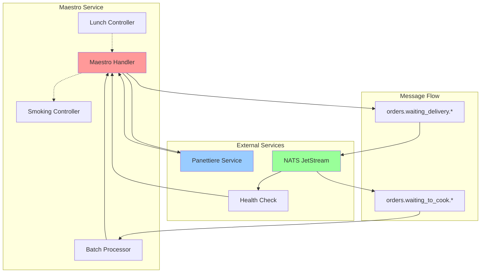
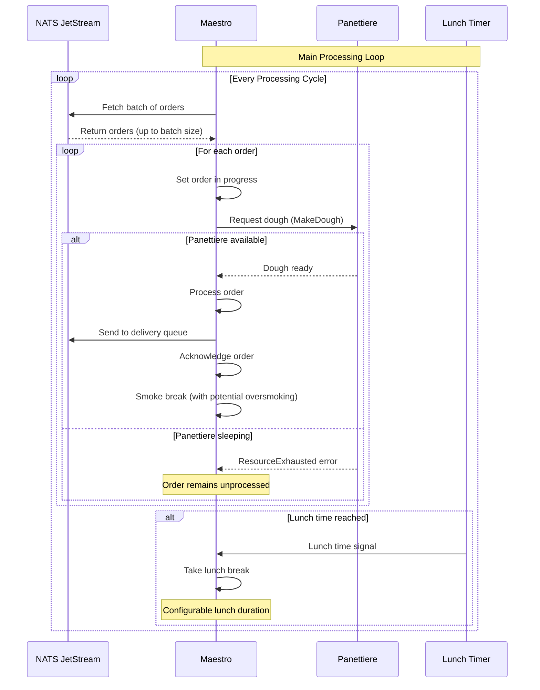
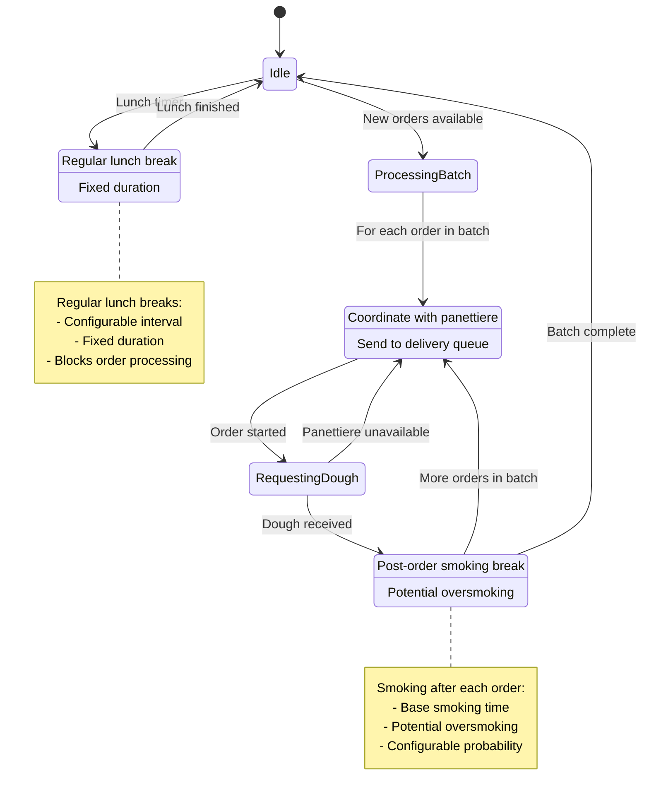

# Maestro

The Maestro is a gRPC microservice that acts as the orchestrator of the pizza ordering system. This service coordinates the entire pizza preparation workflow, managing orders from start to finish while maintaining realistic human behavior patterns including lunch breaks and smoking sessions.

## Service Overview

The Maestro service provides the following functionality:

- **Order Processing**: Consumes pizza orders from NATS JetStream queues and coordinates their preparation
- **Workflow Orchestration**: Manages the flow between different services (panettiere, fornaio, delivery)
- **Batch Processing**: Handles orders in configurable batches for efficient processing
- **Human Behavior Simulation**: Implements realistic work patterns including lunch breaks and smoking sessions
- **Message Queue Integration**: Uses NATS JetStream for reliable order processing and delivery coordination
- **Health Monitoring**: Provides health checks based on NATS connectivity status

## Service Behavior

### Order Processing Workflow
1. **Order Consumption**: Fetches pending orders from NATS JetStream in configurable batches
2. **Dough Request**: Coordinates with the panettiere service to prepare pizza dough
3. **Order Advancement**: Moves processed orders to the delivery queue for the next stage
4. **Smoking Break**: Takes a configurable smoking break after each order (with potential oversmoking)

### Human Behavior Patterns
The maestro follows realistic work patterns:

- **Lunch Breaks**: Takes regular lunch breaks at configurable intervals
- **Smoking Sessions**: Has a smoking break after processing each order
- **Oversmoking**: Random chance to smoke longer than planned (configurable probability)
- **Batch Work**: Processes orders in batches rather than one-by-one for efficiency

### Message Queue Integration
- **Input Queue**: `orders.waiting_to_cook.*` - Orders ready for processing
- **Output Queue**: `orders.waiting_delivery.*` - Orders ready for delivery
- **Stream**: Uses NATS JetStream for reliable message processing with acknowledgments

## API Endpoints

### SayHello
Simple greeting endpoint for service testing:
- **Input**: Name string
- **Output**: Greeting message

## Service Architecture

## Order Processing Flow

## Work Schedule Diagram

## Configuration

The service behavior is controlled through various settings:

### Order Processing
- `OrderBatchSize`: Number of orders to fetch in each batch
- `FetchMaxWaitInSeconds`: Maximum time to wait when fetching orders

### Human Behavior
- `SmokingDurationInSeconds`: Base time for smoking breaks
- `ProbabilityOfOversmoking`: Chance of smoking longer than planned (0.0-1.0)
- `OversmokingFactor`: Multiplier for oversmoking duration
- `PeriodBetweenLunchInSeconds`: Interval between lunch breaks
- `LunchDurationInSeconds`: Duration of lunch breaks

### External Dependencies
- `PanettiereClient`: gRPC client configuration for panettiere service
- `Nats`: NATS connection and JetStream configuration

## Health Checks

The service provides health status based on external dependencies:
- **SERVING**: When NATS connection is healthy
- **NOT_SERVING**: When NATS connection is down

Health checks are updated asynchronously and reflect the service's ability to process orders.

## Metrics and Observability

The service provides OpenTelemetry metrics for monitoring:

### Counters
- `maestro.lunch.count`: Number of lunch breaks taken
- `maestro.smoke.count`: Number of smoking sessions

### Histograms
- `maestro.lunch.duration`: Duration of lunch breaks
- `maestro.smoke.duration`: Duration of smoking sessions

### Tracing
- Full distributed tracing for order processing workflow
- Span correlation across service boundaries
- Error tracking and performance monitoring
