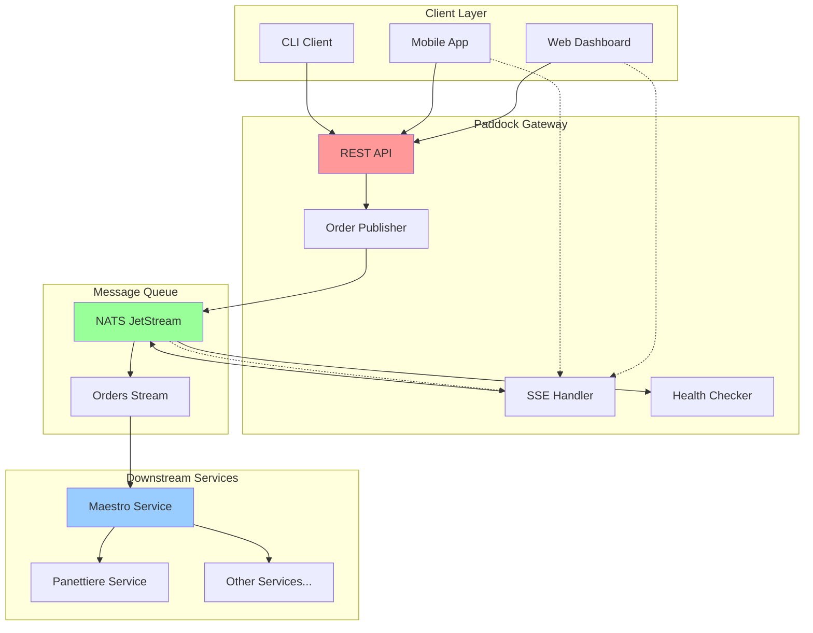
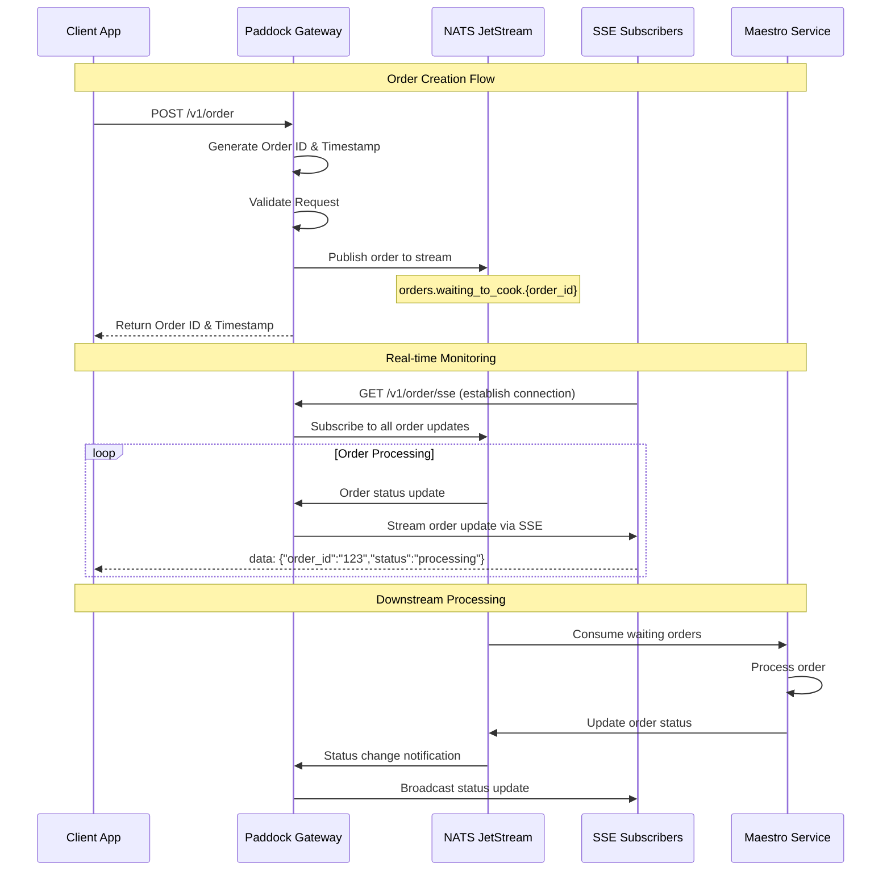
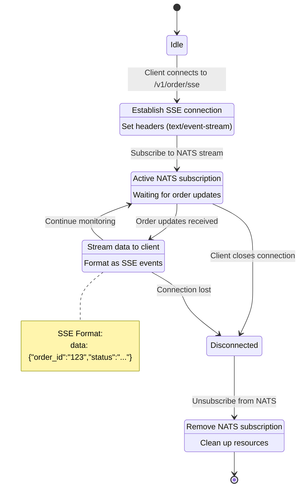
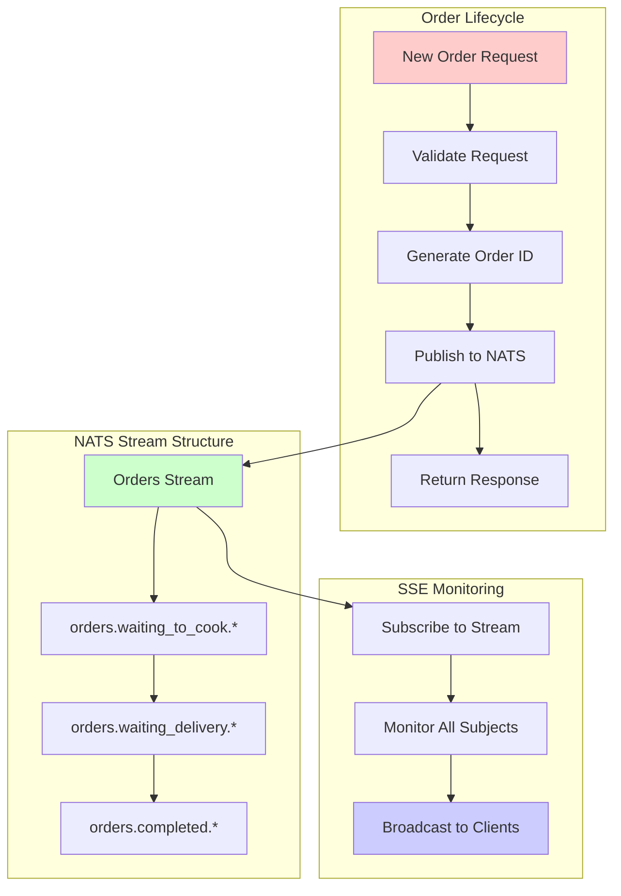

# Paddock Gateway

The Paddock Gateway is a distributed HTTP gateway service that serves as the entry point for pizza ordering requests from Scuderia Ferrari's Formula 1 team. This RESTful API gateway handles order intake, provides real-time order monitoring via Server-Sent Events (SSE), and integrates with the distributed pizza preparation system through NATS JetStream messaging.

## Service Overview

The Paddock Gateway provides the following functionality:

- **Order Intake**: RESTful API endpoint for creating new pizza orders
- **Real-time Monitoring**: Server-Sent Events (SSE) for live order tracking
- **Message Queue Integration**: Publishes orders to NATS JetStream for downstream processing
- **Health Monitoring**: Comprehensive health checks including NATS connectivity
- **API Documentation**: Swagger/OpenAPI documentation with live testing interface
- **Observability**: Full OpenTelemetry integration with metrics, tracing, and logging
- **CORS Support**: Configurable cross-origin resource sharing for web clients

## Service Architecture

The gateway acts as the public-facing interface that bridges HTTP clients with the internal microservices ecosystem through message queues.

### Key Components
- **HTTP Server**: Echo-based REST API with middleware for logging, recovery, and CORS
- **Order Publisher**: NATS JetStream integration for reliable order publishing
- **SSE Broadcaster**: Real-time order updates via Server-Sent Events
- **Health Checker**: Monitors external dependencies (NATS connectivity)
- **Documentation**: Auto-generated Swagger documentation

## API Endpoints

### POST /v1/order
Creates a new pizza order and publishes it to the message queue.

**Request Body:**
```json
{
  "size": "medium",
  "toppings": ["pepperoni", "mushrooms"],
  "destination": "Ferrari Garage #16",
  "username": "charles_leclerc"
}
```

**Response:**
```json
{
  "order_id": "uuid-generated-id",
  "ordered_at": "2025-09-15T10:30:00Z"
}
```

### GET /v1/order/sse
Establishes a Server-Sent Events connection for real-time order monitoring.

**Response Stream:**
```
data: {"order_id":"123","size":"large","status":"pending",...}

data: {"order_id":"456","size":"small","status":"in_progress",...}
```

### GET /healthz
Health check endpoint that reports service and dependency status.

**Response:**
```json
{
  "status": "ok",
  "checks": {
    "nats": {
      "status": "ok"
    }
  }
}
```

## System Architecture



## Order Processing Flow



## Real-time Architecture (SSE)



## Message Flow Architecture



## Configuration

The service behavior is controlled through various settings:

### HTTP Configuration
- `IP`: Server bind IP address
- `Port`: Server port number
- `CORS`: Cross-origin resource sharing settings
  - `Origins`: Allowed origins for CORS requests
  - `Methods`: Allowed HTTP methods
  - `Headers`: Allowed request headers

### NATS Integration
- `URL`: NATS server connection string
- `StreamName`: JetStream stream name for orders
- `Subject`: Base subject pattern for order routing

### OpenTelemetry
- `Endpoint`: OTLP endpoint for telemetry data
- `ServiceName`: Service identifier for tracing
- `Environment`: Deployment environment

## Health Monitoring

The service provides comprehensive health checks:

### Health Check Components
- **NATS Connectivity**: Monitors connection to message queue
- **Service Status**: Overall service health based on dependencies

### Health States
- **OK**: All dependencies healthy, service ready
- **UNAVAILABLE**: NATS connection down, service degraded

Health checks run asynchronously and reflect real-time dependency status.

## Observability

### OpenTelemetry Integration
- **Distributed Tracing**: Full request tracing across service boundaries
- **Metrics Collection**: HTTP request metrics, order processing stats
- **Structured Logging**: Contextual logging with correlation IDs

### Key Metrics
- HTTP request duration and status codes
- Order processing rates and errors
- SSE connection counts and duration
- NATS publish/subscribe metrics

### Tracing Features
- Request correlation across microservices
- Order lifecycle tracking
- Error propagation and debugging
- Performance monitoring

## Security Features

### CORS Protection
- Configurable allowed origins
- Method and header restrictions
- Preflight request handling

### Header Security
- Validation of allowed headers
- Content-Type enforcement
- Cache control for SSE streams

## Development Features

### API Documentation
- **Swagger UI**: Available at `/swagger/*`
- **OpenAPI Specification**: Auto-generated from code annotations
- **Interactive Testing**: Built-in API testing interface

### Debugging Tools
- **pprof Integration**: Performance profiling endpoints
- **Health Dashboard**: Real-time dependency monitoring
- **Structured Logging**: Detailed request/response logging

## Error Handling

The service implements comprehensive error handling:

- **Request Validation**: Input validation with detailed error messages
- **Graceful Degradation**: Continues operation when non-critical dependencies fail
- **Circuit Breaking**: Automatic recovery from temporary failures
- **Timeout Management**: Configurable timeouts for external dependencies

## Deployment Considerations

### Resource Requirements
- Minimal CPU usage for HTTP serving
- Memory scales with concurrent SSE connections
- Network bandwidth for SSE streaming

### Scaling Strategy
- Horizontal scaling supported
- SSE connections distributed across instances
- NATS provides natural load balancing

### Monitoring Recommendations
- Monitor SSE connection counts
- Track NATS connectivity health
- Alert on order publishing failures
- Monitor response time percentiles
