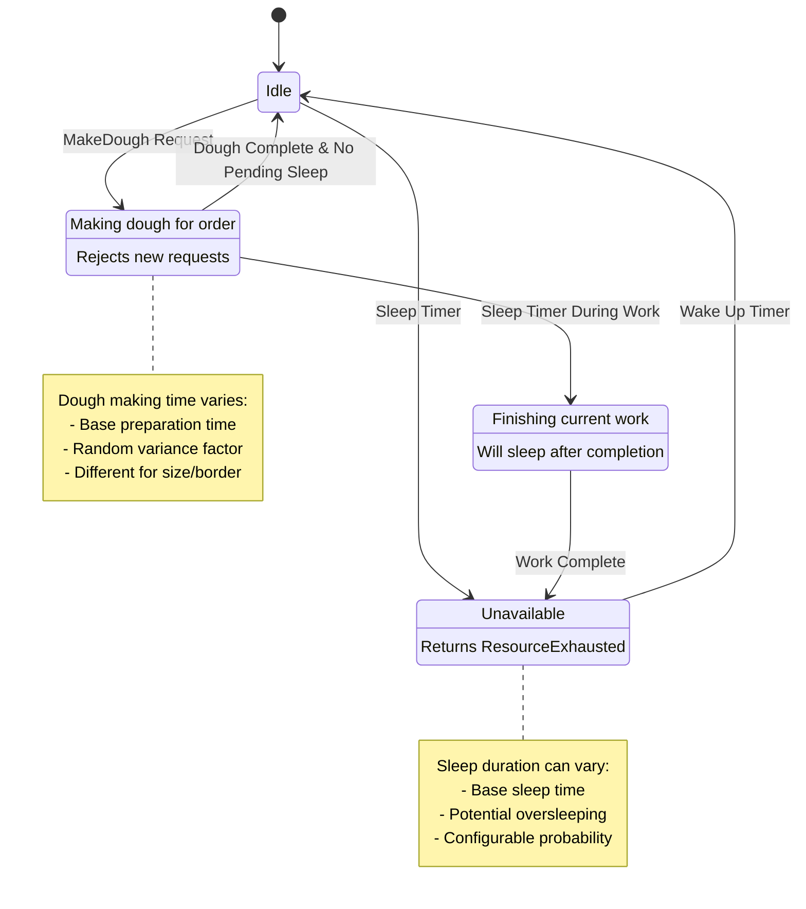
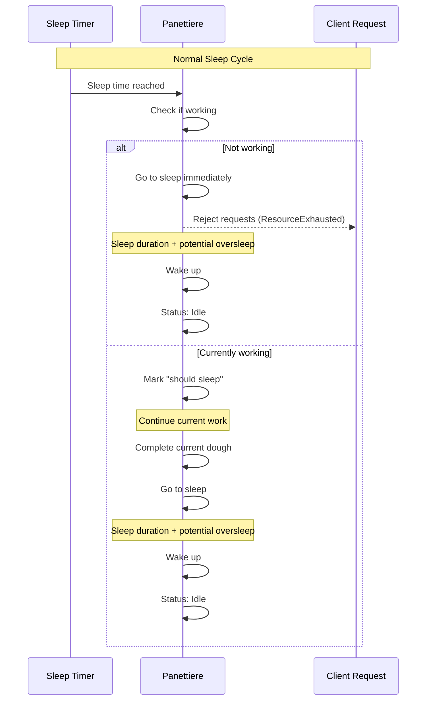

# Panettiere

The Panettiere is a gRPC microservice that simulates a baker who makes pizza dough on demand. This service is part of a larger pizza ordering system and demonstrates realistic behavior patterns including work cycles, sleep schedules, and performance variance.

## Service Overview

The Panettiere service provides the following functionality:

- **Dough Making**: Creates pizza dough based on order specifications (size and border type)
- **Realistic Timing**: Simulates actual dough preparation time with configurable variance
- **Sleep Cycles**: Implements periodic sleep patterns that affect service availability
- **Health Monitoring**: Provides health checks that reflect the baker's current state
- **Order Tracking**: Associates each dough creation with specific order IDs for traceability

## Service Behavior

### Work Patterns
- The panettiere works on one dough order at a time
- Dough preparation time varies based on configured factors to simulate real-world conditions
- Each dough is customized according to border type (e.g., thin, thick) and pizza size

### Sleep Schedule
The panettiere follows a realistic sleep pattern:
- **Periodic Sleep**: Goes to sleep at regular intervals when not actively working
- **Sleep Duration**: Configurable base sleep time with potential for oversleeping
- **Oversleeping**: Random chance to sleep longer than planned (configurable probability)
- **Work Priority**: Won't go to sleep while actively making dough
- **Deferred Sleep**: If sleep time arrives during work, will sleep after completing current order

### Service States
- **Idle**: Ready to accept new dough orders
- **Working**: Currently making dough for an order
- **Sleeping**: Unavailable, will reject new orders with ResourceExhausted error
- **Should Sleep**: Marked for sleep after current work completion

## API Endpoints

### MakeDough
Creates pizza dough according to specifications:
- **Input**: Order ID, border type, pizza size
- **Output**: Dough description
- **Behavior**: Returns error if panettiere is sleeping

### Status
Returns current panettiere status:
- **Output**: Current activity state (idle, working, sleeping, etc.)

## Flow Diagram

## Sleep Cycle Details

## Configuration

The service behavior is controlled through various settings:

- `TimeToMakeADoughInSeconds`: Base time for dough preparation
- `VarianceInDoughMakeInSecondsFactor`: Multiplier for time variance
- `PeriodBetweenSleepInSeconds`: Interval between sleep cycles
- `SleepDurationInSeconds`: Base sleep duration
- `ProbabilityOfOversleeping`: Chance of sleeping longer than planned
- `OversleepingFactor`: Multiplier for oversleep duration

## Health Checks

The service provides health status that reflects the panettiere's availability:
- **SERVING**: When idle or working (can accept new orders)
- **NOT_SERVING**: When sleeping (cannot accept new orders)

Health checks are updated asynchronously based on the current state.