# Tifosi Load Generator 🏎️📊

The Tifosi Load Generator is a K6-based performance testing tool that simulates Ferrari fans (tifosi) ordering pizzas under different race scenarios. This service generates realistic load patterns to test the Box Box pizza ordering system's performance, scalability, and resilience during various Formula 1 race conditions.

## Service Overview

The Tifosi Load Generator provides the following functionality:

- **Realistic Load Simulation**: Models pizza ordering patterns based on Ferrari's race performance
- **Multiple Scenarios**: Different load patterns for winning vs losing race conditions
- **Performance Testing**: Validates system behavior under various stress levels
- **Automated Testing**: Containerized testing with configurable endpoints
- **Metrics Collection**: Comprehensive performance metrics and reporting

## 🏁 Testing Scenarios

### Ferrari is Losing 😢 (`ferrari_is_losing`)
When Ferrari is having a bad race, the tifosi gradually lose their appetite for celebration pizzas.

**Load Pattern:**
- **Ramp Up**: 0 → 10 concurrent users over 10 seconds
- **Sustain**: Maintain 10 users for 10 seconds (disappointed but still hungry fans)
- **Ramp Down**: Drop to 0 users immediately (fans giving up)

**Characteristics:**
- Gradual increase in orders as fans hope for a comeback
- Moderate sustained load representing die-hard fans
- Immediate drop-off when hopes are crushed

### Ferrari is Winning! 🏆 (`ferrari_is_winning`)
When Ferrari is performing well, the tifosi explode with celebration orders!

**Load Pattern:**
- **Base Load**: Start with 10 concurrent users (existing fans)
- **Sustain**: Maintain baseline for 10 seconds
- **Victory Surge**: Spike to 100 users in 2 seconds (celebration explosion!)
- **Celebration**: Maintain high load for 10 seconds (party orders)
- **Cool Down**: Return to 10 users (back to normal celebrations)

**Characteristics:**
- Immediate massive spike representing celebration orders
- Sustained high load during victory lap
- Gradual return to normal as excitement settles

## Load Patterns Visualization


## Scenario Timeline

```mermaid
timeline
    title Ferrari Race Load Scenarios
    
    section Losing Scenario (32s total)
        0-10s    : Gradual ramp-up (0→10 users)
                 : Fans hoping for comeback
        10-20s   : Sustained load (10 users)
                 : Die-hard fans still ordering
        20s      : Immediate drop (10→0 users)
                 : Fans give up completely
    
    section Winning Scenario (32s total)
        0-10s    : Baseline load (10 users)
                 : Normal race watching
        10-12s   : Victory spike (10→100 users)
                 : CELEBRATION EXPLOSION!
        12-22s   : Victory sustain (100 users)
                 : Party continues
        22-32s   : Cool down (100→10 users)
                 : Back to normal celebrations
```



## API Testing Details

### Order Request Structure
Each virtual user (tifosi) sends pizza orders with:

```json
{
  "size": "large",
  "username": "tubias",
  "destination": "manoel moreira",
  "toppings": []
}
```

### Performance Checks
- ✅ **HTTP Status**: Validates 200 OK responses
- ⏱️ **Response Time**: Monitors API response latency
- 📊 **Throughput**: Measures requests per second
- ❌ **Error Rate**: Tracks failed requests

### Load Testing Metrics


## Configuration

### Environment Variables
- `PADDOCK_GATEWAY`: Target API endpoint (default: `http://localhost:8080`)

### Scenario Configuration
The load patterns are defined in `script.js` using K6's scenario configuration:

```javascript
export const options = {
  scenarios: {
    ferrari_is_losing: {
      executor: "ramping-vus",
      startVUs: 0,
      stages: [
        { duration: "10s", target: 10 },
        { duration: "10s", target: 0 },
      ],
      gracefulRampDown: "0s",
    },
    ferrari_is_winning: {
      executor: "ramping-vus", 
      startVUs: 10,
      stages: [
        { duration: "10s", target: 10 },
        { duration: "2s", target: 100 },
        { duration: "10s", target: 10 },
      ],
    },
  },
};
```

## Running Load Tests

### Using Docker Compose (Recommended)
```bash
# Start the complete system first
task aux:up
task services:up

# Run load tests
task load-generator:up
```

### Using Local K6
```bash
# Install K6 (macOS)
brew install k6

# Run load tests locally
task tifosi-load:run

# Or directly with k6
k6 run script.js
```

### Using Docker
```bash
# Build and run in container
docker build -t tifosi-load .
docker run --network host -e PADDOCK_GATEWAY=http://paddock-gateway.docker.localhost tifosi-load
```

## Performance Benchmarks

### Expected Results

#### Ferrari is Losing Scenario
- **Peak RPS**: ~10 requests/second
- **Average Response Time**: <100ms
- **Error Rate**: <1%
- **Duration**: 32 seconds

#### Ferrari is Winning Scenario  
- **Peak RPS**: ~100 requests/second (during victory spike)
- **Average Response Time**: <200ms (under load)
- **Error Rate**: <5% (acceptable under extreme load)
- **Duration**: 32 seconds

### System Stress Points
- **Victory Spike**: Tests system's ability to handle sudden load increases
- **Sustained Load**: Validates long-term stability under high traffic
- **Resource Scaling**: Tests auto-scaling capabilities (if configured)

## Monitoring Integration

### K6 Metrics Output
```bash
# Example K6 output
     ✓ status is 200

     checks.........................: 100.00% ✓ 1248      ✗ 0   
     data_received..................: 1.2 MB  38 kB/s
     data_sent......................: 367 kB  12 kB/s
     http_req_blocked...............: avg=1.15ms   min=0s       med=0s     max=45.71ms
     http_req_connecting............: avg=0.57ms   min=0s       med=0s     max=22.71ms  
     http_req_duration..............: avg=89.71ms  min=51.81ms  med=82.7ms max=294.47ms
     http_req_failed................: 0.00%   ✓ 0         ✗ 1248
     http_req_receiving.............: avg=0.33ms   min=0.11ms   med=0.28ms max=2.77ms
     http_req_sending...............: avg=0.11ms   min=0.04ms   med=0.09ms max=1.22ms
     http_req_tls_handshaking.......: avg=0s       min=0s       med=0s     max=0s
     http_req_waiting...............: avg=89.27ms  min=51.32ms  med=82.27ms max=293.85ms
     http_reqs......................: 1248    39.589917/s
     iteration_duration.............: avg=1.09s    min=1.05s    med=1.08s   max=1.29s
     iterations.....................: 1248    39.589917/s
     vus............................: 10      min=10      max=100
     vus_max........................: 100     min=100     max=100
```

### Integration with Observability Stack
When running with the full system:
- **Jaeger Traces**: Each order generates distributed traces
- **Metrics**: OpenTelemetry captures performance metrics
- **Logs**: Structured logs show order processing flow

## Test Scenarios Explained

### Why These Patterns?

#### Ferrari is Losing
- **Realistic Behavior**: Fans gradually lose enthusiasm
- **System Recovery**: Tests graceful handling of decreasing load
- **Resource Cleanup**: Validates proper resource deallocation

#### Ferrari is Winning
- **Spike Testing**: Simulates viral/celebration traffic spikes
- **Stress Testing**: Pushes system to capacity limits
- **Recovery Testing**: Validates return to steady state

### Real-World Parallels
- **Black Friday**: Sudden traffic spikes for e-commerce
- **Live Events**: Concert ticket sales, sports celebrations
- **News Events**: Traffic spikes during breaking news
- **Social Media**: Viral content traffic patterns

## Development and Customization

### Adding New Scenarios
```javascript
export const options = {
  scenarios: {
    your_custom_scenario: {
      executor: "ramping-vus",
      startVUs: 5,
      stages: [
        { duration: "30s", target: 50 },
        { duration: "60s", target: 50 },
        { duration: "30s", target: 0 },
      ],
    },
  },
};
```

### Custom Assertions
```javascript
check(res, {
  'status is 200': (res) => res.status === 200,
  'response time < 500ms': (res) => res.timings.duration < 500,
  'has order_id': (res) => res.json().order_id !== undefined,
});
```

### Performance Thresholds
```javascript
export const options = {
  thresholds: {
    http_req_duration: ['p(95)<500'], // 95% of requests under 500ms
    http_req_failed: ['rate<0.1'],    // Error rate under 10%
  },
};
```

## CI/CD Integration

### GitHub Actions Example
```yaml
- name: Run Load Tests
  run: |
    docker compose --profile services up -d
    docker compose --profile load up --exit-code-from tifosi-load
```

### Performance Regression Detection
- Set performance baselines
- Compare results across builds
- Fail builds on performance regression
- Generate performance reports

## Troubleshooting

### Common Issues

#### High Error Rates
- Check if services are fully started
- Verify network connectivity
- Monitor resource constraints

#### Slow Response Times
- Check system resource usage
- Monitor database connections
- Verify service health checks

#### Connection Failures
- Validate PADDOCK_GATEWAY environment variable
- Check Docker network configuration
- Verify service discovery

### Debug Mode
```bash
# Run with verbose output
k6 run --verbose script.js

# Enable HTTP debug logging
k6 run --http-debug script.js
```

## Future Enhancements

- **Dynamic Scenarios**: Load patterns based on real F1 race data
- **Geographic Distribution**: Simulate global tifosi locations
- **Mobile vs Web**: Different load patterns for different clients
- **Seasonal Patterns**: Adjust for race calendar and seasons
- **Real-time Adaptation**: Modify load based on system performance

---

**Forza Ferrari! 🏎️** May your systems be as fast as a Ferrari on the straights and as reliable as they are in the corners! 🏁
